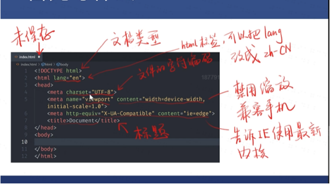

# 甘佳的html入门笔记1

## HTML是欧洲核子研究中心的物理学家蒂姆·伯纳斯-李（Tim Berners-Lee）发明的。详细请点击[这里](https://wangdoc.com/html/intro.html)

## HTML起手应该写什么?
  
  需要!+tab键，详细如下
  ``` <!DOCTYPE html>
<html lang="zh-CN">
<head>
    <meta charset="UTF-8">
    <meta name="viewport" content="width=device-width, initial-scale=1.0">
    <mate http-equiv="X-UA-Compatible" content="ie=edge">
    <title>Document</title>
</head>
<body>   
</body>
</html>
```

## 常用的表章节的标签
* h1~h6:标题
* section：章节
* article：文章
* p：段落
* header：头部
* footer：脚部
* main：主要内容
* side：旁支内容
* div：划分区域
## 全局属性
* class(给标签分类，给区域做标记，方便后续操作，例如，``` <div class="middle">```，意思是命名此div区域为middle，后可以在head中对此区域进行背景颜色调整等，如```[class=middle]{background:blue;color:white}```或者是```.middle{background:blue;color:white}```)。
* contenteditable(使选中的区域可以手动编辑页面文字，例如```<div class="middle" contenteditable>```，div区域可以编辑)
* hidden(让任何东西看不见)例如```<div hidden class="middle" contenteditable>```那么此div区域的东西都将看不见。
* style(html的属性，优先级比CSS高，JS可以覆盖HTML)标签默认是不被看见的，如果想要被看见，需要如下条件，可以让用户手动编辑背景颜色等等
  
  1. 首先保证style标签不在head里。head默认是不被看见的。
  2.  在其他位置填下如下代码```<style>stlyle(display:block;)</style>```
* id(标记，全页面唯一的用id，非特殊情况不用id用class。id不报错，尽量不要用。)
* tabindex(可交互的东西都可以用tab访问)如下，先访问header，后访问div，0为最后访问内容，不会访问footer 
  ```
  <header tabindex=1></header>
  <div tabindex=0></div>
  <footer tabindex=-1><footer>
  ```
* title(显示鼠标放上去，未点击的时候所显示的提示内容)
## 常用的内容标签
* ol+li(ordered list+list item)有序列表+列表项目```<li>吃饭 </li><li>睡觉</li><li>打豆豆</li>```
* ul+li无序列表+列表项目
* dl+dt+dd描述列表dl+词+描述内容
  
  打出来？dl+tab键
* pre保留所有html 空格，回车，tab，例如```<p1><pre>      这是一段话 </pre></p1>```
* code code里面的字是等宽的，一般用来写代码
* hr水平分割线
* br换行
* a用于插入网站 a标签里的href是在当前页面打开，换成target可在其他页面打开
* em强调，语气强调
* strong重要，加粗
* quote引用
* blockquote换行引用