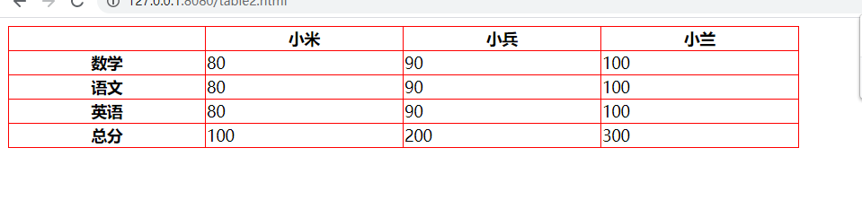

## 输入 yarn global add http-server 后输入 hs -c-1 打开网页，禁止双击打开 html

## a 标签的用法
* 跳转外部界面
* 内部锚点
* 跳转邮箱电话
## a 标签的属性
- href  超级链接

```
<a href="//google.com" target="xxx">xxx新建一个页面打开Google</a>
<a href="//baidu.com" target="xxx">xxx新建一个页面打开baidu</a>
<a href="//baidu.com">baidu</a>
```
href的取值：网址
```
<a href="/a/b/c">c.html</a>
<a href="a/b/c">c.html</a>
<a href="index.html">index.html</a>
```
href的取值：路径

```
<a href="javascript:alert(1);">javascript伪协议</a>
<a href="javascript:;">空的伪协议</a>
<a href="javascript:;">查看</a>
<a href="#xxx">查看xxx</a>
<a href="mailto:1355930320@qq.com">发送邮件给甘佳</a>
<a href="tel：18779173475">打电话给甘佳</a>
```
href的取值：伪协议

* target
  
  1. _blank(当前页面打开) 
  2. _self（自身页面打开）
  3. _parent（上一级页面打开）
  4. _top(最顶层页面打开)
## img标签的用法
发出get请求，展示图片

* src(用于连接图片地址)
* alt(用于在图片显示失败后展示所显示失败的是啥)
* height（图片高度）
* width（图片宽度）（高度宽度选一项否则图片会变形）
  
  下列第二行语句可以用于将图片显示在手机中心

```
  <src="dog.png" alt="一只狗子" />
    <style>
      * {
        margin: 0;
        padding: 0;
        box-sizing: border-box;
      }
      img {
        max-width: 100%;
      }
    </style>
```
## table 标签的用法
制作表格

* table
* thead
* tbody
* tfoot
* tr（ the row）
* td （the data）
* th（the head）
  
  ```
     <style>
      table {
        width: 800px;
        table-layout: auto;
        border: spacing 0;
        border-collapse: collapse;
      }
      td,
      th {
        border: 1px solid red;
      }
    </style>
  </head>
  <body>
    <table>
      <thead>
        <tr>
          <th></th>
          <th>小米</th>
          <th>小兵</th>
          <th>小兰</th>
        </tr>
      </thead>
      <tbody>
        <tr>
          <th>数学</th>
          <td>80</td>
          <td>90</td>
          <td>100</td>
        </tr>
        <tr>
          <th>语文</th>
          <td>80</td>
          <td>90</td>
          <td>100</td>
        </tr>
        <tr>
          <th>英语</th>
          <td>80</td>
          <td>90</td>
          <td>100</td>
        </tr>
      </tbody>
      <tr>
        <th>总分</th>
        <td>100</td>
        <td>200</td>
        <td>300</td>
      </tr>
      <tfoot></tfoot>
    </table>
    ```
    
    ## input标签
   Button里可以加入其他的标签，但是input里不能放其他标签
   例如：

   ```
  <button>
        <strong>搞起</strong>
        
        </button>
    ```
    ```
     <input type="submit" />
     ```
     总结；今天学习了html的一些常用标签，目前还是能够理解相关的一些意义及一些标签之前的区别，希望能加油努力尽早学好。详细需要见html demo-2。

