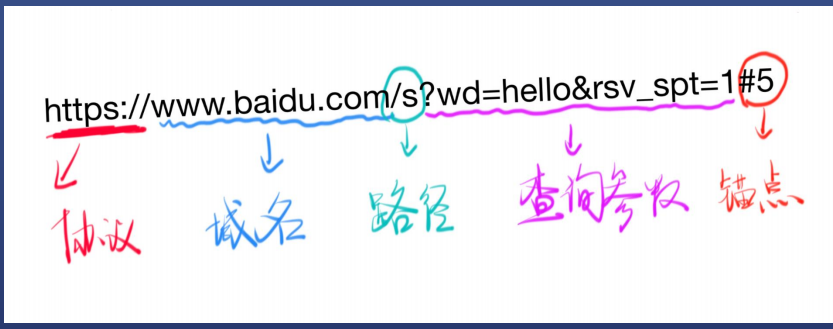

# 浅析URL
URL（统一资源定位符 Uniform Resource Locator）

## URL 包含哪几部分，每部分分别有什么作用
协议+域名或IP+端口号+路径+查询字符串+锚点
https端口为默认为443；

### HTTP
HTTP协议是基于TCP和IP两个协议

用curl可以发HTTP请求

curl -v http://baidu.com

curl -s -v https://www.baidu.com

注：
url会被curl工具重写，先请求DNS获得IP
先进行TCP链接，TCP连接成功后，发送HTTP请求
请求、响应结束后，关闭TCP连接（看不出来），真正结束。
### 域名

IP(Internet Protocol)网际互联协议

IP分为内网IP和外网IP

* 租用宽带，连接路由器，就会有一个外网IP（重启路由器，可能会重新分配）
* 路由器创建内网，内网中的设备使用内网IP，一般格式是192.168.X.X
  
特殊的IP：

* 127.0.0.1 表示自己
* localhost通过hosts指定为自己（可以编辑hosts自定义）在 Windows 系统中，hosts 位于 C:\Windows\System32\drivers\etc\hosts 。在 macOS / Linux系统中，hosts 位于 /etc/hosts
* 0.0.0.0不表示任何设备

域名就是对IP的别称

一个域名可以对应不同的IP，均衡负载

一个IP可以对应不同域名，共享主机

ping命令
ping qq.com（可以得到对应qq的IP）

域名和IP是如何对应的呢？ DNS（Domain Name System）
过程：
1. 当你输入域名，浏览器会向网络运营商的DNS服务器询问对应的IP（nslookup命令）
nslookup命令  `nslookup baidu.com` 得到百度的IP地址
2. 浏览器向对应的IP的 **80/443端口** 发送请求
3. 请求内容是查看域名首页。
服务器默认80端口提供http服务，443端口提供https服务（开发者工具可以看到具体的端口）

域名级别：

顶级域名：.com

二级域名：xxx.com 俗称一级域名

三级域名：www.xxx.com 俗称二级域名 （是xxx.com的子域名)

### 端口（port）
一台机器可以提供不同服务

* HTTP服务最好使用80端口
* https服务使用443端口
* ftp服务使用21端口

一共65535个端口
端口使用规则：

* 0~1023号端口是留给系统使用的端口，只有拥有管理员权限才能使用
* 其他端口普通用户可以使用，如http-server默认使用8080端口（http-server -c -1 -p 1234 把端口改为1234）

### 锚点
锚点无法在Network面板看到，因为锚点不会传给服务器
