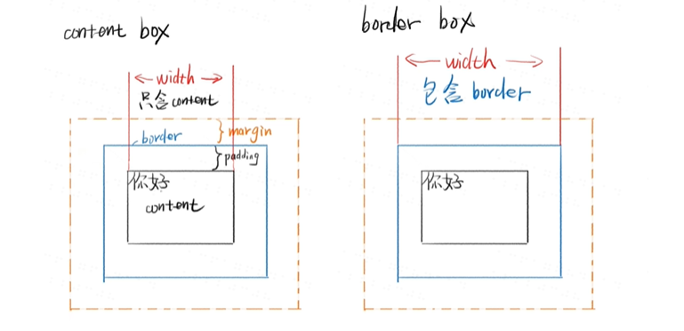
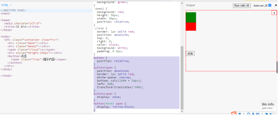
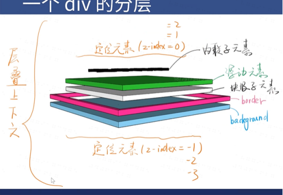

# css总结
## border 调试法
```border:1px solid red;```
使用时可以查看元素是否出现问题，一行行往下copy，如果没有出现border的话就是相应的上一句有问题。
## 盒模型
content-box和border-box，一般选用border-box；

区别：
content-box ，宽度只是包含content；

border-box，宽度包含border+ padding+content，高度也是类似。



## css不懂查询
chrome 搜索关键词+mdn

caniuse.com 网站查询兼容性

## 文档流

* block：元素从上到下，每一个另起一行，宽度可用width指定。高度由文档流元素决定，可以设置高度。
* inline：元素从左到右，直至右边才会换行，宽度为inline元素的总和，不能指定，高度由line-height间接决定，与height无关。
* inline-block：结合前两者特点，元素从左到右，可以用width，height决定。

如何脱离文档流:float  position:absolute/fixed

## margin合并
父子，兄弟margin会合并

如何阻止合并？

父子合并用padding/border overflow:hidden display:flex挡住

兄弟合并可以用inline-block消除

## 长度单位
px em 百分数 整数
## 颜色单位

rgba(0,0,0,1)红色绿色蓝色透明度

hsla(180,50%,50%,1)色像 饱和度 亮度 透明度

十六进制：##FF6600或者F60

## float布局

兼容IE9

子元素加上float:left;
父元素需要加上class="clearfix"
```
.clearfix:after{
    content:'';
    display:block;
    clear:both;
}
```
http://js.jirengu.com/dararibola/1/edit

负margin使用方法见这里。

## flex 布局(常用，不兼容最新浏览器，之前的也许兼容)
  
  变成flex容器
  ```
  .container{
      display:flex;或者是display:inline-flex;
  }
  ```
  改变流动方向
  ```
  .container{
      flex-direction:row/column;
  }
  ```
  换行
  ```
  .container{
      flex-wrap:wrap;
  }
 ```
 主轴对齐方式（默认是横轴，除非改变了flex-direction的方向）
 ```
 .container{
justify-content:center/space-between/*放中间/空隙居中*/
 }
 ```
 次轴对齐（默认是纵轴）
 ```
 .container{
     align-content:center;
 }
 ```

 ## grid布局（只兼容最新浏览器）

 将布局分开，详细例子可见
 http://js.jirengu.com/jehimadotu/1/edit?html,css,output
http://js.jirengu.com/zayehinema/1/edit?h，tml,css,output
http://js.jirengu.com/bolubikovu/1/edit?html,css,output

 ```
 .container{
     display:grid/inline-grid;
 }
```
设置行列
```
.demo {
  display: inline-grid;/*适应宽度*/
  grid-template-rows: 240px repeat(4, 120px);
  grid-template-columns: 250px 250px;
  border: 1px solid red;
  grid-template-areas: "big mid1" "big mid2" "sml1 mid2" "sml2 mid3" "sml3 mid3";
}
```
Items可以设置范围
```
.items{
    grid-column-start: ;
    grid-column-end: ;
    grid-row-start: ;
    grid-row-end: ;
}
```
## Position的五个取值
* static默认值，待在文档流里。
* relative相对定位，但不脱离文档流，配合z-index使用
* absolute绝对定位，定位基准非static
* fixed固定定位，关于视口的定位。
* sticky粘滞定位
 http://js.jirengu.com/yumecikequ/1/edit?html,css,output


absolute相对于祖先元素中最近的一个定位元素定位的；见例子中


## 层叠上下文


## css动画

浏览器渲染原理：根据html构建html树（dom） 根据css构建css树（cssom） 将dom和cssom合并成一颗渲染树（rendertree） Layout布局（文档流，盒模型，计算大小和位置） Paint绘制（边框颜色，文字颜色等） Compose合成（层叠关系展示画面）

悬浮的心（利用transition）：
http://js.jirengu.com/cinuyucufu/1/edit?html,css,output

跳动的心（利用animation）
http://js.jirengu.com/yugicosase/1/edit?html,css,output

声明关键帧
```
@keyframes heart {
  0% {
    transform: scale(1.0);
  }
  100% {
    transform: scale(2);
  }
}
```