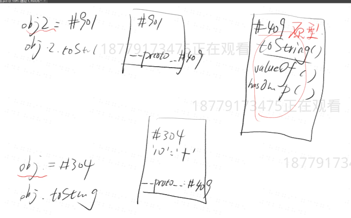

# js的对象
## 定义
* 无序的数据集合
* 键盘值对的集合
## 写法
```
let obj = { 'name': 'frank', 'age': 18 }
let obj = new Object({'name': 'frank'})
console.log({ 'name': 'frank, 'age': 18 })
name是属性名 frank是属性值
```
## 注意
1. 键名是字符串（数字可以在第一个），不是标识符（数字不能在第一个），可以包含任意字符
2. 引号可省略，省略之后就只能写标识符（中间不能带空格）
3. 就算引号省略了，键名也还是字符串（重要）

举例

属性名要注意加引号，否则会先变成数字，再变成字符串，所以1e2会先变成100，后变成字符串，同理见下。
```
let obj = {
  1: 'a',
  3.2: 'b',
  1e2: true,
  1e-2: true,
  .234: true,
  0xFF: true
};
```
```
Object.keys(obj)
=> ["1", "100", "255", "3.2", "0.01", "0.234"]

```
加一个[]改变属性名

不加 [ ] 的属性名会自动变成字符串

加了 [ ] 则会当做变量求值

值如果不是字符串，则会自动变成字符串
```
let obj ={
    [1+2+3+4]:'十'
}属性名为'10'（1+2+3+4）
```
```
let p1 = 'name'
let obj = { p1 : 'frank'} 这样写，属性名为 'p1'
let obj = { [p1] : 'frank' } 这样写，属性名为 'name'
```
除了字符串，symbol 也能做属性名
```
let a = Symbol()
let obj = { [a]: 'Hello' }
```
### 隐藏属性
JS 中每一个对象都有一个隐藏属性

这个隐藏属性储存着其共有属性组成的对象的地址

这个共有属性组成的对象叫做原型(见下图，并不是#409，而是里面的东西)

也就是说，隐藏属性储存着原型的地址（见下图，地址是#409）



## 删除属性
```
delete obj.xxx或者是delate obj['xxx']
```
xxx是属性名,上面删除方法会将属性名及值都删除
```
obj.xxx = undefined
```
上面这种方法只是将属性值改为undefined，也就是里面会有xxx：undefined

不含属性名
```

'xxx' in obj === false
```
含有属性名，但是值为 undefined
```
'xxx' in obj && obj.xxx === undefined
```
注意 
```
obj.xxx === undefined
```
不能断定 'xxx' 是否为 obj 的属性
## 查看属性
查看自身所有属性

Object.keys(obj)

查看自身+共有属性

console.dir(obj)

判断一个属性是自身的还是共有的

obj.hasOwnProperty('toString')

查看属性

obj['key'] 

## 增加修改属性
批量赋值
```
Object.assign(obj, {age: 18, gender: 'man'})
```
## 修改隐藏属性
推荐使用 Object.create
```
let common={kind: 'human'}
let obj = Object.create(common)
obj.name = 'frank'
```
规范大概的意思是，要改就一开始就改，别后来再改
## 总结
删
```
delete obj['name']
'name' in obj // false
obj.hasOwnProperty('name')  // false
```

查
```
Object.keys(obj)
console.dir(obj)
obj['name']
obj.name // 记住这里的 name 是字符串
obj[name]  // 记住这里的 name 是变量
```
改
```
改自身 obj['name'] = 'jack'
批量改自身 Object.assign(obj, {age:18, ...})
改共有属性 obj.__proto__['toString'] = 'xxx'
改共有属性 Object.prototype['toString'] = 'xxx'
改原型 obj.__proto__ = common
改原型 let obj = Object.create(common)
注：所有 __proto__ 代码都是强烈不推荐写的
```
## 'name' in obj和obj.hasOwnProperty('name') 的区别

'name' in obj 只能查看obj里是否有这个属性，不能查看是不是共有属性还是自身有的

obj.hasOwnProperty('name') 查看的是自身有的属性，不是共有属性。


